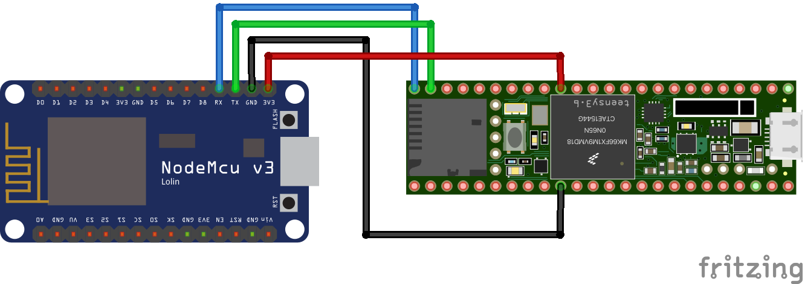
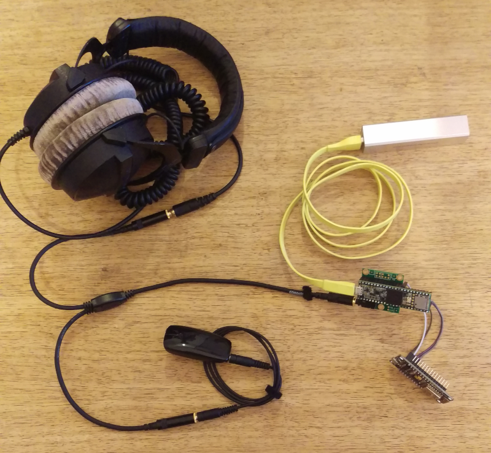

WiFi Hearing
============

Sonification of WiFi data to offer a sense for the electromagnetic fields around you.

For hardware a ESP-8266 wifi chip, a Teensy 3.6 and the Teensy Audio shield are used.

All code in this repo is licensed under GPLv3. See [LICENSE.md](./LICENSE.md).

Schematic
---------

The WiFi Hearing is designed to be used togehter with a cochlear implant as an extention of the senses for data, but it can also be used together with headphones.
You can read more about it in more details in this [blog post](https://foaly.github.io/wifi-hearing.html).

Build Notes
-----------

To flash the wemos LoLin NodeMCU v3 using the Arduino IDE use the following settings:

* Board: "NodeMCU 1.0 (ESP-12E Module)"
